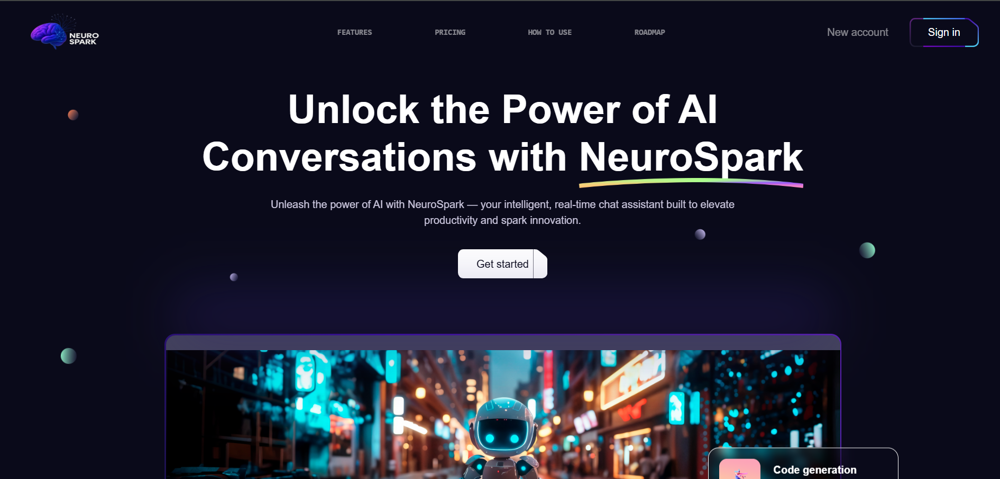

## 🌟 What is NeuroSpark?

**NeuroSpark** is a stunning, high-performance web UI/UX kit built with **React**, **Tailwind CSS**, and **Framer Motion**. Designed for creators, startups, and marketers — it empowers you to launch bold, modern web pages with scroll-triggered animations, glassmorphism, gradient overlays, and smooth transitions.

Whether you're building a personal brand, product landing page, or digital portfolio — NeuroSpark brings your content to life.

---

## 🚀 Key Features

- 🎯 **Lightning-fast Performance** – Powered by Vite/Next.js with optimized rendering
- 🎨 **Dark Aesthetic with Gradient Overlays** – Modern, striking color schemes (Dark Blue + Violet)
- 🌀 **Framer Motion Animations** – Smooth scroll-triggered effects for text and images
- 🧱 **Reusable Components** – Cards, sections, headings, call-to-actions, logos, and more
- 💡 **Tagline Support** – Editable brand lines that connect with your audience
- 📱 **Fully Responsive Design** – Pixel-perfect layouts for mobile, tablet, and desktop
- 🧠 **Creative Focus** – Built to help people create beautiful content, effortlessly
- 🧩 **Custom Fonts** – Integrated with Sora, Source Code Pro, Space Grotesk
- 🔍 **SEO Ready** – Semantic tags, meta structure, accessibility compliance
- ⚡ **Smooth Page Transitions** – Zero jank, buttery scroll behavior
- 🔄 **Dynamic Image & Text Pairing** – No more stuck frames or jerky visuals

---

## 🧠 Built With

| Tech Stack | Description |
|------------|-------------|
| **React** | UI Framework |
| **Tailwind CSS** | Utility-first styling |
| **Framer Motion** | Animation library |
| **Vite / Next.js** | Build & dev tooling |
| **Heroicons & Lucide** | Icon system |
| **PostCSS** | Extended Tailwind support |

---

## 📷 Preview



---

## 🛠️ Getting Started

```bash
# Clone the repository
git clone https://github.com/your-username/neurospark.git
cd neurospark

# Install dependencies
npm install

# Start local server
npm run dev

Your app will be running at http://localhost:3000.

🧪 Folder Structure (Basic)
neurospark/
├── assets/               # Static assets (e.g., images)
├── components/           # Modular UI components
├── pages/ or src/        # Main pages (depends on framework)
├── styles/               # Tailwind & custom styles
├── public/               # Public files (e.g., logo, favicon)
├── package.json          # Project metadata

🤝 Contribution
We welcome creative minds! Here’s how you can contribute:

🔍 Open issues for suggestions or bugs

🚀 Fork & PR to add new animations or UI sections

🖌️ Submit design tweaks that elevate the UX

📫 Contact
Made with ❤️ by Krishna sahu
DM krishna.sahu.work@gmail.com

